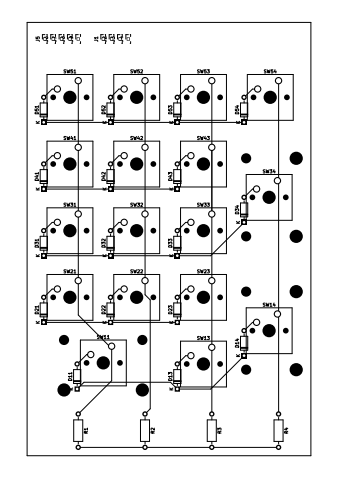
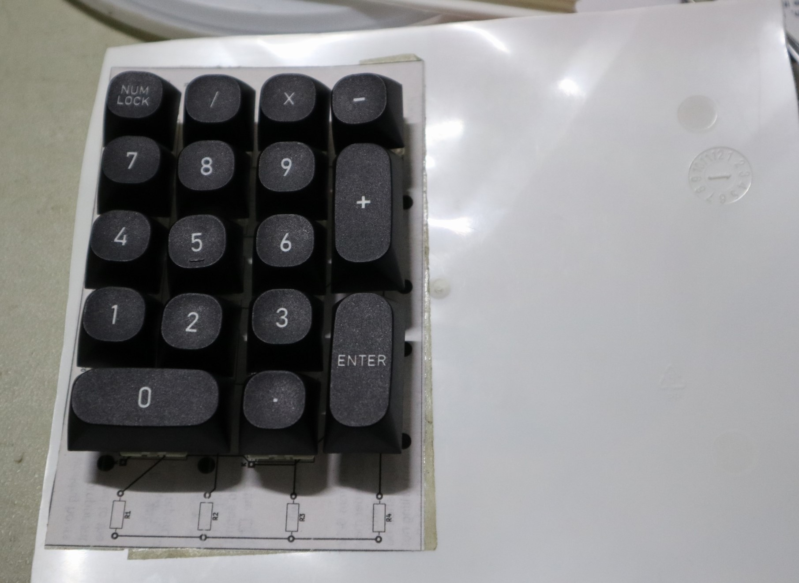
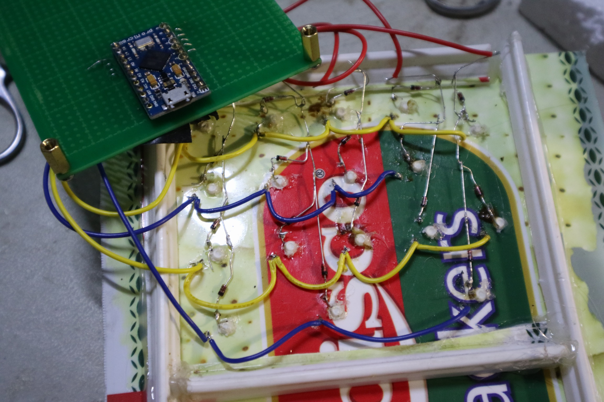

# simplenumpad
A very basic, hacked together mechanical numpad.

## Introduction

This was made with the goal of having a numpad to go with a mechanical keyboard lacking one.
Since I didn't want to bother with either buying a kit or going to a manufacturer to get a pcb, this is made using basically as few new parts as possible.
Most of the parts that aren't the electronics are just random garbage around the house.

## Parts List
Because this project doesn't use a PCB, all of the parts listed are through-hole components (THT).

|Part               |Quantity |
|:--:               |:--------|
|Cherry MX Switches | 17      |
|1n4148 Diode       | 17      |
|Arduino Pro Micro  | 1       |

That's pretty much it. You can even skip the diodes if you want to put in the anti-ghosting features in software. Stabilizers for the larger keys are optional.

## Layout
The layout is done in KiCad, but only because it's easy to get footprints for different kinds of mechanical switches, and print the design.
**The PCB design is used mainly as a wiring and layout guide. It is not meant to be manufactured and is not made to manufacturing specifications or common practice.**

## Assembly

### Circuit Board

The first step is to punch, drill, or otherwise make the holes to mount the switches. You'll want to use PCB mount switches if you can, but I got away with plate-mounted switches, since they still at least have that big peg in the middle. These switches will more or less **be stuck where they are after the build, for the most part.** This *is* a really hacky, dirty way of doing it, but it is cheap. Jam the switches in, and then use hot glue or some other adhesive should you need it. You can put your keycaps on as well, if you want.

### Wiring

Use the schematic and layout as a guide when wiring the rows and columns. Make sure all of your diodes are facing the same direction (If you get them all backwards you should be able to fix it in software, but only if they're all backwards).

## Code

This uses the SET library by RobTillaart ([Link](https://github.com/RobTillaart/SET)).
The code energizes columns and reads rows in a matrix, then puts them in sets and gets the difference to figure out which keys are newly pressed or released. The code will only press and release the keys as needed.

## Finished!

That's about it. Good luck!

